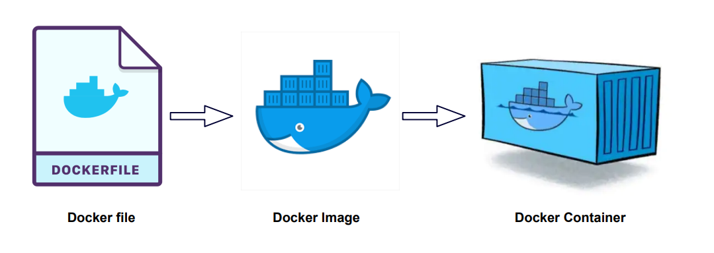

> 도커의 핵심 개념
> 
> 

> 
> Docker Image (도커 이미지)
> 

**도커 이미지**는 컨테이너를 생성하기 위한 파일 시스템과 실행할 애플리케이션의 소스 코드, 라이브러리, 환경 설정 등의 모든 것을 포함하는 템플릿이다. 이미지는 읽기 전용으로 구성되어 있으며, 도커 컨테이너를 시작할 때 해당 이미지가 기반이 된다. 이미지는 여러 개의 레이어로 구성되어 있는데, 각 레이어는 변경 사항이 있는 파일 또는 설정을 포함하고 있으며, 이들 레이어는 상속 구조를 가지고 쌓여 최종 이미지를 구성한다. 이 레이어 구조로 인해 이미지 간에 공통된 부분을 효율적으로 공유할 수 있다.

이러한 이미지는 Dockerfile이라는 텍스트 파일을 사용하여 정의되는데, Dockerfile에는 기반 이미지, 추가할 파일, 실행할 명령어, 환경 변수 설정 등이 포함된다. 이미지는 도커 레지스트리에 저장되거나 공유될 수 있다.

> Docker Container (도커 컨테이너)
> 

**도커 컨테이너**는 이미지를 실행한 격리된 프로세스 환경으로 도커 이미지를 실행하면 컨테이너가 된다. 이미지는 컨테이너의 파일 시스템과 애플리케이션 코드 등을 제공하며, 컨테이너는 이 이미지를 기반으로 생성된다. 컨테이너는 가상화된 환경에서 동작하며, 호스트 운영체제의 리소스와 격리된 리소스를 사용한다. 각 컨테이너는 독립된 환경에서 실행되므로, 하나의 컨테이너의 변화나 문제가 다른 컨테이너에 영향을 주지 않는다.

컨테이너는 생성되고 실행되면 컨테이너의 파일 시스템은 읽기/쓰기가 가능한 상태로 변하며, 해당 컨테이너의 애플리케이션을 실행하게 된다. 애플리케이션 실행이 끝나면 컨테이너는 종료되며, 해당 컨테이너에서 발생한 변경 사항은 컨테이너가 삭제되면 사라진다.

> 웹페이지를 띄우기 위해 도커를 사용하는 경우를 생각해 보면,
> 

> Docker Hub

도커 허브(Docker Hub)는 도커 이미지를 저장하고 공유할 수 있는 클라우드 기반 레지스트리 서비스이다. 도커 허브는 개발자 및 조직들이 도커 이미지를 중앙에서 관리하고 배포하기 위한 플랫폼으로 사용된다.

 > 주요 기능
> 
- **이미지 저장 및 공유**: 도커 허브를 사용하면 도커 이미지를 업로드하여 저장하고, 필요한 경우 해당 이미지를 다른 사용자와 공유할 수 있다. 개발자들은 자신의 이미지를 업로드하고 커뮤니티와 공유하거나, 조직 내에서 사용할 이미지를 업로드하고 팀원들과 공유할 수 있다.
- **이미지 버전 관리**: 도커 허브에서는 이미지의 여러 버전을 관리할 수 있다. 각 버전은 태그를 통해 구분되며, 이를 통해 특정 버전의 이미지를 선택하여 사용할 수 있다.
- **자동 빌드**: 도커 허브는 GitHub, Bitbucket 등의 버전 관리 시스템과 연동하여, 소스 코드 변경 시 자동으로 도커 이미지를 빌드하고 업데이트할 수 있는 자동 빌드 기능을 제공한다. 이를 통해 개발자는 코드 변경 시 자동으로 이미지를 갱신할 수 있다.
- **조직 및 팀 지원**: 도커 허브는 조직과 팀을 생성하여 멤버 간에 이미지와 리소스에 대한 접근 권한을 관리할 수 있는 기능을 제공한다. 팀원들끼리 협업하거나 역할에 따라 이미지를 관리할 수 있다.
- **웹 인터페이스**: 도커 허브의 웹 인터페이스를 통해 이미지를 검색하고 둘러볼 수 있다. 이미지에 대한 정보, 태그, README 등을 확인할 수 있다.
- **오토메이션 지원**: 도커 허브 API를 사용하여 이미지 업로드, 다운로드, 관리 등을 프로그래밍 방식으로 자동화할 수 있다..

