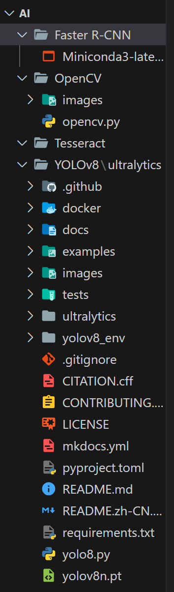

# YOLOv8
* 설치 완료 후 돌려보았음
* 처리 속도와 실시간성(?)은 있지만 정확도가 떨어짐
    * 카드나 버즈 케이스를 핸드폰으로 인식하고, 과자 봉지를 핫도그로 인식하는등 오류가 조금 있음
    * 정확도를 0~1 사이값으로 표시해주지만 이 잘못 인식한 것에 대한 정확도를 표시하는 경우도 많음

# OpenCV
* 비교분석할 예정

# Faster R-CNN
* 비교분석할 예정
* 생각보다 파일 용량이 큼
* 설치중 계속 특정 부분에서 오류 발생 -> 조금더 해볼 필요가 있음

# Tesseract
* 비교분석할 예정