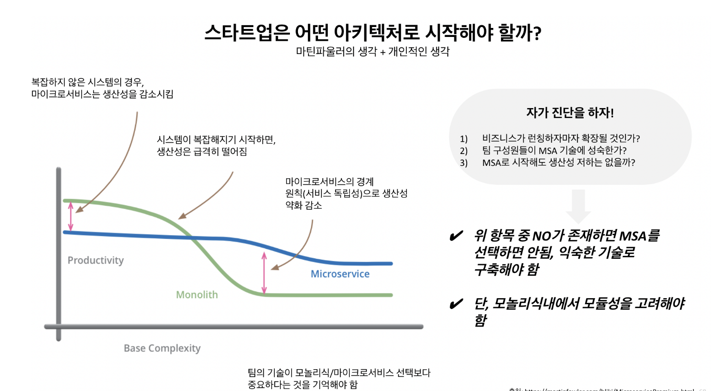

# MSA 구조 학습

- Microservices Architecture
    - MSA는 하나의 큰 애플리케이션을 독립적으로 배포 및 운영할 수 있는 작은 서비스들로 나누어 관리하는 아키텍처 스타일

- 특징
    - 독립된 서비스
    - API 기반 통신
    - 독립적인 배포
    - 데이터베이스 분리

- 장점
    - 확장성: 각 서비스가 독립적으로 확장 가능하므로, 특정 서비스에 대한 수요가 증가할 경우 해당 서비스만 확장하면됨

    - 유연성: 개발 팀이 특정 기술 스택이나 언어에 얽매이지 않고 자유롭게 선택할 수 있음. 서로 다른 팀이 각각의 서비스에서 서로 다른 언어와 도구를 사용할 수 있음.

    - 신속한 배포: 작은 서비스 단위로 배포가 이루어지므로, 빠르게 새로운 기능을 추가하거나 버그를 수정할 수 있음.

    - 고가용성: 하나의 서비스에 문제가 생겨도 다른 서비스들은 영향을 받지 않으므로, 시스템 전체의 가용성이 높아짐.

- 단점
    - 복잡한 서비스 관리: 많은 서비스가 독립적으로 운영되기 때문에, 전체 시스템의 복잡성이 증가할 수 있음.

    - 데이터 일관성 문제: 각 서비스가 독립된 데이터베이스를 가지는 경우, 데이터 일관성을 유지하는 것이 어려움.

    - 모니터링 및 디버깅: 많은 서비스가 존재하기 때문에, 각각의 상태를 모니터링하고 문제를 추적하는 것이 복잡해질 수 있음. 따라서 효과적인 로깅, 모니터링, 트레이싱 시스템이 필요함.

    - 네트워크 성능: 서비스 간 통신이 네트워크를 통해 이루어지기 때문에, 네트워크 지연이나 성능 이슈가 발생할 수 있음.

결론 : 사실상 MSA구조를 채택하지 않는 것이 싸피 프로젝트 상 맞지만 MSA구조를 경험하고 싶은 팀원들이 많아 좀 더 공부해보고 적용해보고 싶다!
